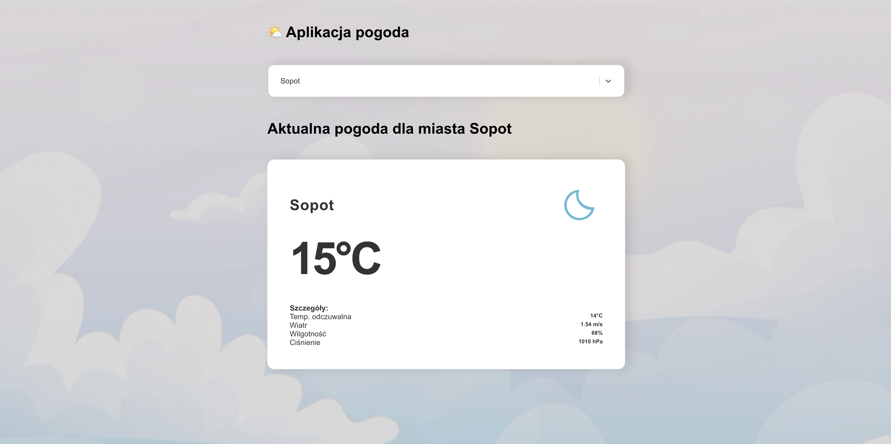

# Aplikacja pogoda

Aplikacja wykorzystująca React do wyświetlania pogody w miastach w polsce.

## Funkcjonalność

* Wyszukiwanie miast z API GeoDB Cities (https://rapidapi.com/wirefreethought/api/geodb-cities)
* Wyświetlanie pogody dla wybranego miasta z API OpenWeather (https://openweathermap.org)
* Responsywność

## Użyte biblioteki

* react-select-async-paginate - do asynchronicznego wyświetlania wyników wyszukiwania miast w wyszukiwarce miast
